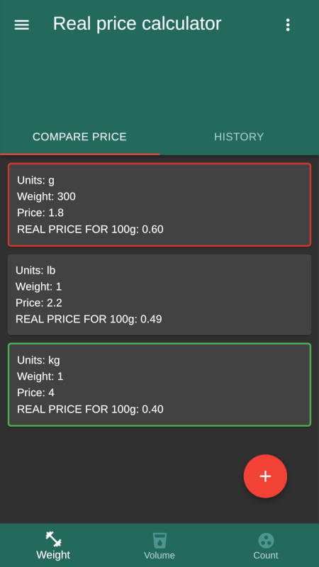
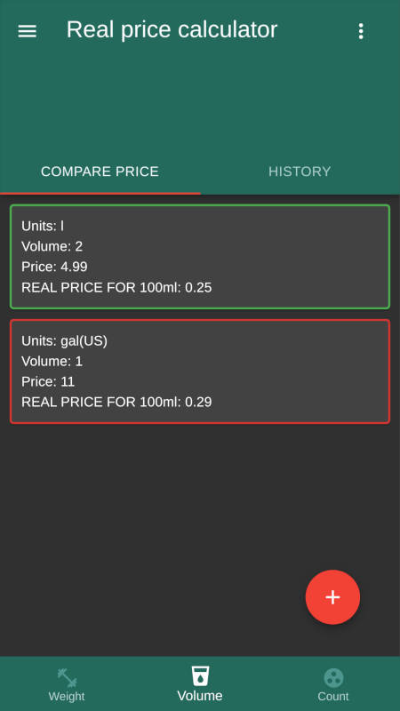
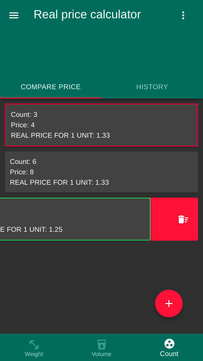
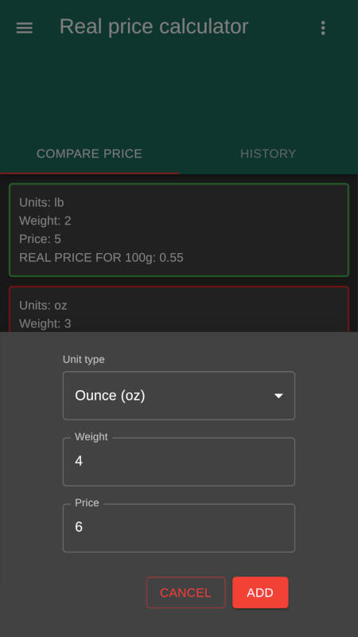
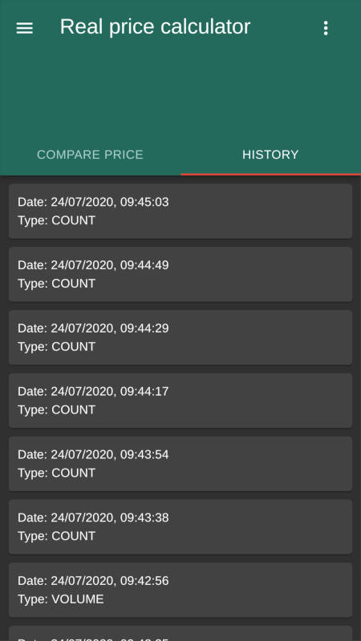
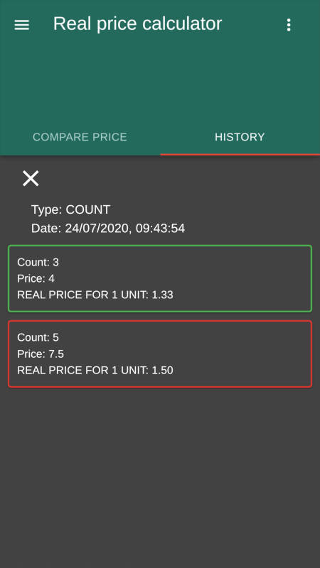

# Real price calculator

26 Jul 2020

[Link to Real Price Calculator](https://maksimkotau.github.io/real-price-calculator/)

*Mobile PWA application for compare prices of goods in the store. Its interface is based on the principles of Material Design*

This application allows you to compare the prices of goods in different units of measurement (by quantity, volume and weight). It allows you to view the history of comparisons.

## Compare price in weight units:

Available units for comparison:

- Gram
- Kilogram
- Ounce
- Pound

## Compare price in volume units:

Available units for comparison:

- Milliliter
- Liter
- Pint US
- Quart US
- Gallon US

## Compare price by count:

Every tab support delete element by swipe left action. Or you can delete all elements using top-right menu.

## Adding a product for comparison

Adding a new product to comparison is intuitive and easy.

## History view

History view allows you to view previous product comparisons.

## Configuration

In menu you can choose a light or dark theme

